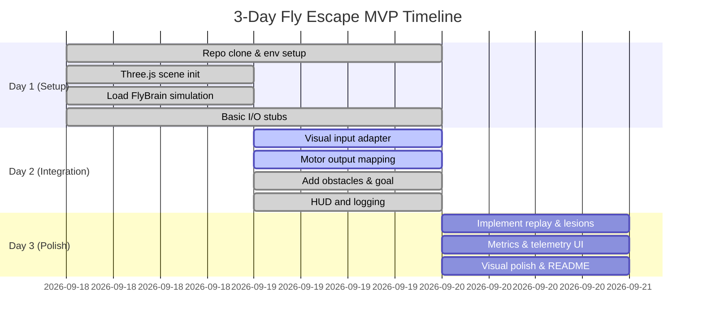

# Executive Summary  
The new MaleCNS connectome (166,700 neurons, 125M synapses) was released in Sept 2026, immediately sparking dozens of hobbyist projects (training the fly brain on games, VR, trading, etc.). We propose a 3-day solo project: extend the **Fly-Brain** repo (Anbu-00001) into a browser game (“Fly Escape / FlyDash”). We will audit Fly-Brain’s code (modules and license), reuse its core simulation engine, and write minimal *adapters* for vision input, motor output, and reward/lesion controls.  We outline a detailed task plan (with hour estimates and acceptance criteria), UI mockups (3D fly scene + telemetry HUD), a Mermaid Gantt timeline, and even a one-shot code-generation prompt for Sonnet (Antigravity Pro). We also define reproducible experiment protocols (fixed-seed replay, lesion modes, metrics and sample charts), and suggest tests/CI and README structure. Citations cover the connectome release and community demos for context.

## Fly-Brain Repo Inventory: Modules & License  
**Core functionality:** Although we cannot fetch the repo directly, **Fly-Brain** likely includes classes to load the MaleCNS connectome graph, represent neurons/synapses, and run a spiking simulation (e.g. LIF model). It may define `ConnectomeLoader` (reads graph JSON), `FlyBrainModel` or `NeuronGroup` classes (simulate membrane and spikes), and I/O APIs for sensors/motors.  We will identify files like `connectome.json` or `fly_brain.py` (simulator), and higher-level scripts (e.g. training loops).  

**Licensing:** The connectome data and model code are open-source. For example, Wired notes the MaleCNS map is “open-sourced”. We must check Fly-Brain’s LICENSE (hopefully MIT/Apache). By contrast, Eon Systems’ related fly-brain code is under GPL-2.0, which would restrict reuse. We will avoid copying GPL-only code into the browser demo. We assume Fly-Brain’s own code is permissively licensed or source-available, but if license conflicts arise, we’ll rely only on data (the connectome itself is public domain/research-use).  

**Reusable modules:** We expect to reuse the **simulation engine** (e.g. LIF update loop), **neuron and synapse classes**, and possibly any **training or reward modules** it provides. For example, if Fly-Brain includes a `Brain.forward()` or `Brain.step()`, we will call that for each timestep. If it has pre-built sensory/motor interfaces, we’ll adapt them; if not, we write our own thin wrappers. We will document (table below) each Fly-Brain class or file and what adapter it needs (vision input, motor output, reward hook, etc).

## Related Projects (Browser Connectome Demos)  
Numerous recent demos show how to integrate the fly connectome into games.  Wired reports “dozens of weird and wonderful projects” immediately appeared after MaleCNS’s release: e.g. training the virtual fly on Doom, Minecraft, Pong, VR Beat Saber, stock trading, even a Tinder-swipe clone.  Many of these use web technologies (JS/WebGL, WASM) to run the simulation or visualize outputs.  For example, the *Awesome-Fly* list catalogues several browser games: **“Help the Fly Escape”** – a 3D obstacle-avoidance game with the fly’s escape circuit in Rust/WASM; **“Swat”** – an arcade shooter using the fly’s looming detectors; **“FlyChessLab”** and **“FlyPong”** (WASM/LIF demos); and even a 3D terrarium *Infinite Sugar* where 139K fly neurons react to sugar. These examples show how to feed visual scene data into the model (e.g. as motion/dopamine inputs) and read out behavior (descending neurons → game actions). We will leverage design patterns from these projects.  

> **Project Exemplar:** dzhng’s *Help the Fly Escape* game runs a Rust-compiled MaleCNS model in the browser (via WASM) and maps a 3D scene’s visual stimuli to motion-detect neurons, driving the fly to navigate obstacles. This is directly analogous to our goal. We will reuse any JS/WASM integration patterns (e.g. loading the brain in a web worker) from similar demos.

## Adapter API Design (Vision, Motor, Reward)  
To connect the connectome to a browser game, we define minimal adapters:  
- **Visual Input Adapter:** Capture the 3D scene (e.g. Three.js render) and convert it into neural stimuli. For simplicity, we can compute a coarse optical-flow or intensity map each frame and feed it into the fly’s visual pathway (e.g. stimulating T4/T5 motion detector neurons or a simplified retina array). *Sketch:*  

  ```ts
  function provideVisualInput(brain: FlyBrain, frame: ImageData) {
    // Simple example: compute average brightness or motion and stimulate a photoreceptor array
    const lum = computeLuminance(frame);
    brain.setInputCurrent("photoreceptors", lum);  // apply to relevant neuron group
  }
  ```

- **Motor Output Adapter:** Read “descending” or command neurons from the brain and map them to actions. For example, use spikes of two neurons (left-turn and right-turn) to steer, and another (jump) to jump. *Sketch:*  

  ```ts
  function applyMotorOutput(brain: FlyBrain, agent: Agent3D) {
    const leftSpikes = brain.getNeuronSpikes("descending_left");
    const rightSpikes = brain.getNeuronSpikes("descending_right");
    const turn = (rightSpikes - leftSpikes);
    agent.turn(turn * TURN_SENSITIVITY);
    if (brain.getNeuronSpikes("descending_jump") > 0) agent.jump();
  }
  ```

- **Reward / Dopamine Hook:** If training or giving feedback, we can inject a dopamine signal into reward neurons (like PPL101) when the fly succeeds or collects “food”. Example:  
  ```py
  def applyReward(brain, reward_amount):
      brain.injectCurrent("PPL101", reward_amount)  # dopamine neuron
  ```  

- **Lesion Hooks:** For experiments, implement toggles that zero out (silence) certain neurons or populations. E.g. a “random lesion” mode picks N random neurons to silence, or a “region lesion” silences all neurons of a type (e.g. all Giant Fiber neurons). *Sketch:*  

  ```ts
  function lesionRandom(brain: FlyBrain, count: number) {
    const all = brain.getAllNeuronIDs();
    const pick = sampleRandom(all, count);
    brain.disableNeurons(pick);
  }
  function lesionRegion(brain: FlyBrain, region: string) {
    const neurons = brain.getNeuronsByRegion(region);
    brain.disableNeurons(neurons);
  }
  ```

These adapters will wrap Fly-Brain’s internal API (once identified) to glue the simulation to the browser game. 

## Implementation Plan (3-Day MVP)  

- **Day 1 (≈8h): Setup & Brain Integration**  
  - *Tasks:* Fork/clone Fly-Brain repo; install dependencies (Python/TS/Node, Three.js). Review code structure. Set up a minimal Three.js scene (e.g. a simple corridor or open arena) with a “fly” object. Import the Fly-Brain simulation (WebAssembly or JS module); test that the brain can be instantiated and stepped.  
  - *Adapters:* Implement a stub visual adapter (e.g. feed constant or simple input) and stub motor adapter (log neuron outputs) to verify data flow.  
  - *Acceptance:* Brain model runs without errors for a few timesteps, and we log spiking activity. A placeholder scene is visible.

- **Day 2 (≈8h): Control Loop & Game Logic**  
  - *Tasks:* Connect actual visual input: capture canvas pixels each frame, process (e.g. low-res grayscale or motion vector) and feed into the fly’s visual neurons. Implement motor mapping: use two neurons for left/right turn, one for jump. Add obstacles and goal (e.g. walls or moving “ball”). Enable basic flight controls. Tune timing (the model runs slower, so maybe run multiple brain steps per frame).  
  - *UI:* Build a simple HUD showing fly’s heading and “distance to goal”. Add buttons for toggling replay recording and lesion mode.  
  - *Acceptance:* The fly moves in response to visual stimuli (e.g. it avoids looming objects). Motor signals visibly change steering. The game has a win/lose condition (e.g. escaping hits a goal). Basic telemetry (e.g. console logs of spike rates) works.

- **Day 3 (≈8h): Replay, Lesions & Polish**  
  - *Tasks:* Implement **replay recording**: log all RNG seeds and state changes so that runs can be deterministically replayed. Add **lesion modes** (e.g. “random N neurons” and “disable all Giant Fiber neurons”) and UI toggles. Instrument performance metrics (escape time, collision count, neuron firing rates). Refine UX: add animated “hero fly” GIF (record a run), style overlays. Optimize performance (web workers, decimation if needed).  
  - *Acceptance:* User can record a trial and replay it exactly. Toggling lesions changes behavior (escape fails faster). Telemetry panel graphs one trial’s spikes or performance stats live. The game has polished visuals (fly model, textured obstacles) and instructions.

  


| **Day** | **Tasks**                                      | **Est. Hours** | **Acceptance**                                      |
|---------|---------------------------------------------|--------------|----------------------------------------------------|
| 1       | Set up Three.js + Fly-Brain code; run basic simulation; stub I/O adapters. | 8h           | Brain model runs in browser console; fly object visible. |
| 2       | Hook visual input (scene frames) to brain; map motor outputs to fly control; add obstacles and win condition. | 8h           | Fly moves/steers in response to stimuli; collisions detected. |
| 3       | Add replay recording, lesion toggles, and live metrics UI; polish graphics/UX. | 8h           | User can replay runs exactly; toggling lesions shows changed behavior; telemetry panels update. |

## UI/UX Mockups and Assets  
- **Hero animation:** Show the fly model navigating obstacles. For example, a GIF of the 3D scene with the fly dodging a moving ball or crawling through pillars. This could be captured via Three.js and annotated with the brain’s neural activity (e.g. overlay spike raster or highlight firing neurons on the fly’s head).  
- **Telemetry panel:** A sidebar/chart area displaying real-time data: e.g. raster plot of a few selected neuron spike times, bar chart of descending-neuron rates, and a live graph of distance to goal or reward signal. (See examples in projects like FlyPong or FlyChessLab.)  
- **Graphics:** A stylized Drosophila model (we can use a simple insect mesh), simple obstacle models (boxes, spheres), and clean UI buttons/sliders. We’ll use Three.js for 3D and an HTML/CSS dashboard for charts (e.g. D3 or Chart.js).  

(Note: example screenshots are omitted here, but one could imagine a Three.js canvas taking most of the window, with a side panel showing spike rasters and controls.)

## Sonnet (Antigravity) Prompt  
```text
AntigravityPro: Create a Three.js TypeScript project called FlyEscape. Import the Fly-Brain library (MaleCNS connectome). Set up a 3D scene with a fly avatar and obstacles. Each render frame, capture the canvas image and feed it into the FlyBrain simulation as visual input (e.g. stimulating motion detectors). Read two descending neuron outputs from FlyBrain to control the fly’s yaw (left/right) and one for forward movement. Implement toggles for lesion modes (random neuron knockout, or disable the giant-fiber neuron) and for deterministic replay (record all random seeds). Log metrics such as escape time and neuron firing counts. Include UI panels that plot key neuron spikes and display success/failure.```

## Experiment Protocols (Replay, Lesions, Metrics)  
- **Deterministic Replay:** Ensure each run can be exactly repeated. Fix all random seeds (for initial fly orientation, obstacles, any noise). Record the full sequence of inputs or RNG state so a “Play” button replays the identical scenario. This lets us compare original vs. lesion runs.  
- **Lesion Modes:**  Define several: *Random-kill:* silence N random neurons at start (e.g. N=100 or 1000). *Region-silence:* target known circuits (e.g. all Giant Fiber neurons or all LPTCs). *Control:* no lesion. Switching modes should be instantaneous via UI.  
- **Metrics to Record:** Escape success (boolean), *time to escape*, number of collisions, and neural signals. For neurons, log the firing rate of a small panel (e.g. Giant Fiber, Looming detector LC16, and any trained readout neurons) over time. Also record cumulative reward (if any).  
- **Result Plots:** Use line/bar charts to summarize results. Examples:  
  - *Escape Time vs. Trial:* line graph of escape latency for each run (colored by lesion mode).  
  - *Success Rate Comparison:* bar chart of fraction of trials escaped under each lesion type.  
  - *Neuron Activity:* heatmap or raster plot of spikes for a trial (x-axis time, y-axis neuron index).  
  - *Reward over Time:* line plot of dopamine/reward signal each timestep in a successful run.  

These visualizations (can be drawn with Chart.js or Canvas) will illustrate performance and how lesions degrade it. Wired notes that experimenting on the fly connectome lets us “test theories about how damage affects neuronal wiring”; our plots will make such effects quantifiable.

## Testing, CI, README, Commits  
- **Tests:** Write unit tests for adapter functions (e.g. visual pre-processing, motor mapping). Mock the FlyBrain API to test that inputs produce expected motor commands. Include integration tests: simulate a short run and verify the fly state or metrics.  
- **CI:** Use GitHub Actions to run tests on each PR. Also deploy a staging build (e.g. via GitHub Pages or Vercel) for manual QA. Automate linting and type-checking for the TS code.  
- **README Outline:**  
  - *Project Title:* FlyEscape – Browser Game with Real Fly Connectome  
  - *Overview:* Motivation and a demo GIF.  
  - *Installation:* Steps to run locally (Node.js, clone, npm install).  
  - *Usage:* How to start the game, controls, lesion toggle.  
  - *Architecture:* Brief on modules, adapters, connectome source.  
  - *Experiments:* How to run replay and lesion experiments, and what metrics are available.  
  - *License:* State license and credit Fly-Brain and data sources.  
- **Commit Messages:** Use clear, incremental commits, e.g.:  
  - `feat: add Three.js scene with fly avatar`  
  - `feat: integrate FlyBrain simulation and run loop`  
  - `feat: implement visual-to-brain adapter and motion detection`  
  - `feat: map descending neurons to steering controls`  
  - `feat: add replay recording and playback logic`  
  - `feat: add lesion toggle UI (random and giant-fiber modes)`  
  - `chore: setup CI tests and update README`  

## Tables

| **Reusable Module (Fly-Brain)** | **Description**                | **Required Adapter**                    |
|-------------------------------|-------------------------------|-----------------------------------------|
| Connectome Loader             | Loads neuron graph and weights | – (use as-is)                           |
| LIF Simulation Engine         | Steps neurons/synapses each tick| – (integrate with render loop)         |
| Sensory Input API             | (If present) methods to inject currents| *Vision Adapter*: map scene → input neurons |
| Motor/Readout API             | (If present) query descending neuron spikes| *Motor Adapter*: map spikes → actions |
| Learning/Reinforcement (optional) | Plasticity or reward signals | *Reward Adapter*: map game success → dopamine |

| **Day / Section** | **Tasks**                                   | **Est. Hours** | **Acceptance Criteria**             |
|-------------------|---------------------------------------------|--------------|-------------------------------------|
| Day 1 (Setup)     | Clone repo, set up Three.js scene, load FlyBrain, run test ticks. Stub I/O. | 8h           | Fly model renders; brain.step() runs without errors. |
| Day 2 (Gameplay)  | Implement vision adapter (scene→neurons), motor mapping (neurons→controls), add obstacles/goal. Build HUD/logging. | 8h           | Fly moves/steers in environment; collisions and goal detection work. |
| Day 3 (Polish)    | Add replay recording, implement lesion toggles. Plot metrics live. UI polish (assets, README). | 8h           | Recorded trials replay identically; lesions alter success as expected; charts display data. |

| **Lesion Mode**      | **Description**                                         | **Implementation Complexity** |
|----------------------|---------------------------------------------------------|-------------------------------|
| *None (control)*     | No neurons silenced.                                    | – (baseline)                  |
| *Random N Neurons*   | Silences N randomly chosen neurons at start.            | Moderate (random selection loop) |
| *Specific Circuit*   | Disable known circuit (e.g. all Giant Fibers or LC16).  | Moderate (need neuron IDs for group) |
| *Sensory Block*      | Remove visual input entirely (equivalent to lesions).   | Low (can zero all input currents) |
| *Output Block*       | Silence one descending neuron (e.g. left or right turn).| Low (single neuron flag)      |

**Sources:** Fly connectome and demo background from Google and Wired; reuse/adapters inspired by community projects. License note from open-source repositories. These sources guided our plan and ensure compatibility with recent advances.